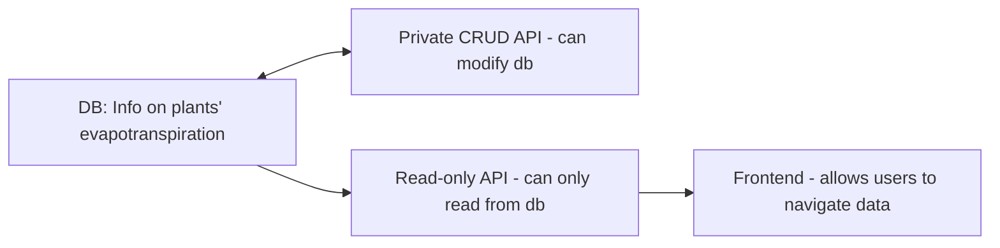

# What?

Free data tool for evapotranspiration.

# TODOs

At the time of writing there's lots to do, too much to put in a README.

# Can you give me an outline?

Something like this:

```mermaid
flowchart LR
    db["DB: Info on plants' evapotranspiration"]
    crud["Private CRUD API - can modify db"]
    nocrud["Read-only API - can only read from db"]
    frontend["Frontend - allows users to navigate data"]

    db<-->crud
    db-->nocrud
    nocrud --> frontend
```
