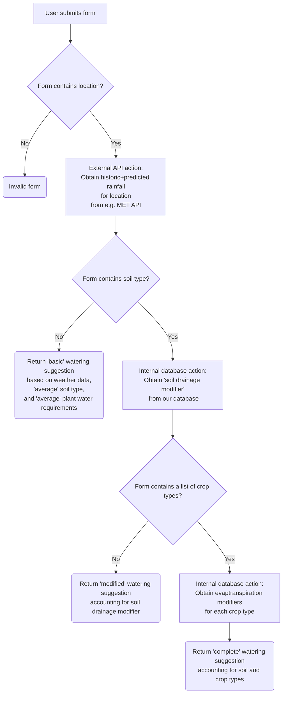

# What?

An online application where users can enter their location, soil-type and the crops they are growing to get up-to-date advice on per-crop watering requirements (Liters or watering cans per square-meter) based on Met-office (or other weather API) observations of precipitation, cloud-cover and wind, and forecasts for the area. Additionally it could be built out to use long-term historical weather conditions for the area along with site information to suggest crops that would work well for the user's space.

# Why?
Similar advice is available from government sources on a subscription basis, mostly used by farmers to manage water requirements in large scale agriculture. However the advice is based off of evapotranspiration models that are openly published and available, and could be provided for free or cheaply (by this app) to smaller scale agriculture projects, individual gardeners or people building out automated irrigation systems. Crop suggestions determined from historical weather conditions could be combined with other services that determine optimal terrain conditions for 'permaculture' style farming to provide a more complete agro-forestry/permaculture planning toolset.

# TODOs

See https://github.com/nseymoursmith/waterlogged-prototype/issues

# User flow

